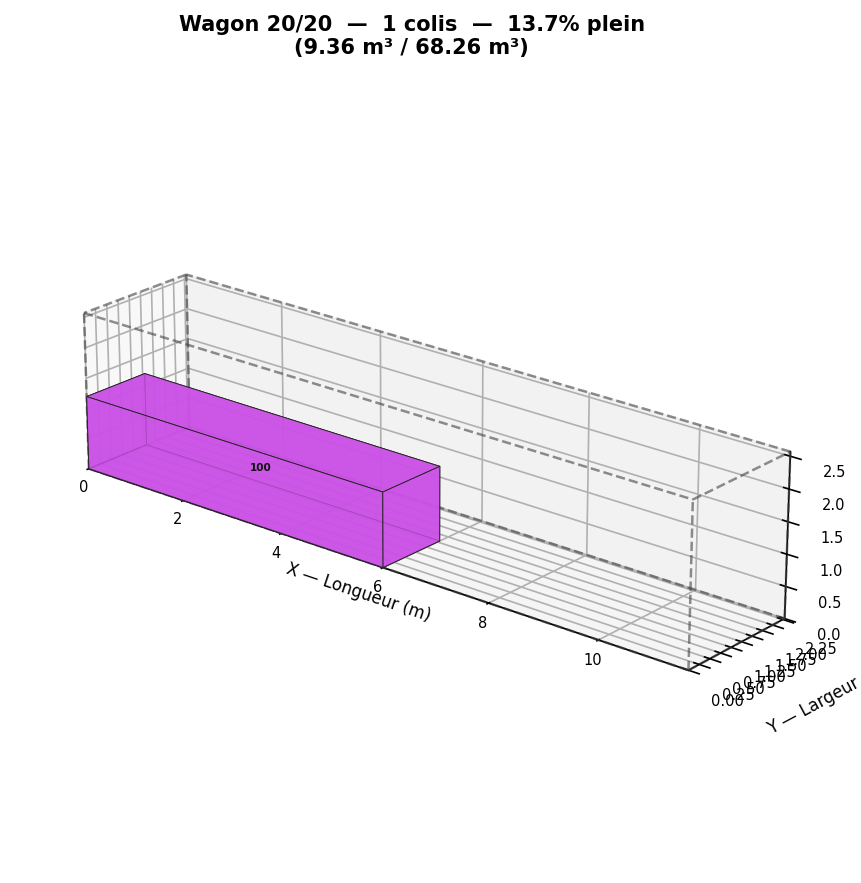
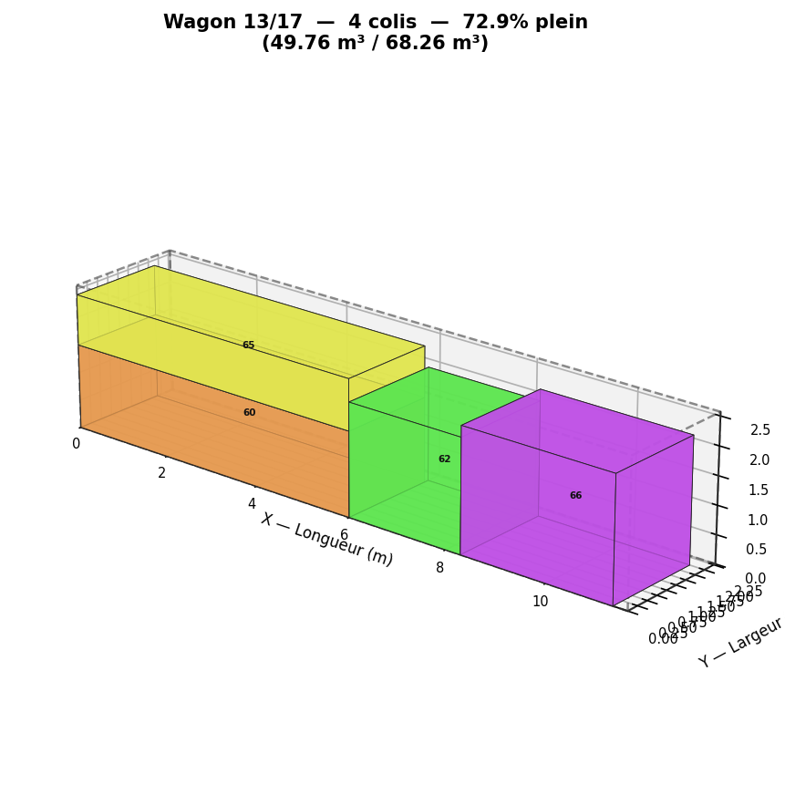

# Optimisation Logistique : Projet RO (Bin-Packing)

## 📌 Contexte du Projet
Ce projet a été réalisé dans le cadre du module de **Recherche Opérationnelle** en 3ème année d'école d'ingénieurs (ISEN Ouest).
L'objectif industriel est d'optimiser le chargement d'un train de fret de la SNCF en minimisant le nombre de wagons nécessaires pour transporter un ensemble de colis de tailles et contraintes variées.

Le projet met en évidence le compromis fondamental de l'ingénierie entre **l'exactitude mathématique** et **la viabilité industrielle (temps réel)** face au mur de l'explosion combinatoire.

## 🧠 Architecture Algorithmique
Le projet est divisé en deux grandes parties, explorant la complexité croissante des dimensions (1D, 2D, 3D) et des contraintes de flux (Online vs Offline).

### Partie 1 : Le problème du Sac à Dos (Démonstration du NP-Difficile)
* **Algorithme Exact (Force Brute) :** Mise en évidence de l'explosion combinatoire ($O(N!)$).
* **Heuristique Gloutonne :** Résolution approchée avec tri par ratio utilité/masse.
* **Métaheuristique (Recuit Simulé) :** Surpassement des optimums locaux par refroidissement progressif.

### Partie 2 : Le Bin-Packing appliqué au Fret
* **Dimension 1 (Linéaire) :** Algorithmes *First-Fit* et *Best-Fit*.
* **Dimension 2 (Surfaces) :** Moteur de partitionnement géométrique **MaxRects** couplé aux heuristiques *BLSF* (Best Large Side Fit pour le mode Online) et *BSSF* (Best Short Side Fit pour le mode Offline).
* **Dimension 3 ONLINE (Flux tendu) :** Moteur spatial basé sur les **Extreme Points** (Corner-Points) pour une résolution ultra-rapide adaptée aux chaînes logistiques continues.
* **Dimension 3 OFFLINE (Planification) :** Implémentation d'un **Algorithme Génétique** (Croisement OX, Mutations, Multiprocessing) pour brasser une population de solutions et approcher la borne inférieure théorique.

## 📊 Visualisation 3D
Un module de rendu 3D a été développé pour visualiser l'agencement réel des colis dans les wagons SNCF. 

 

## 🛠️ Technologies et Outils
* **Langage :** Python 3
* **Librairies :** `Matplotlib` (Rendu 3D isométrique), `Multiprocessing` (Calcul parallèle pour l'Algorithme Génétique).

## 👨‍💻 Contributeurs
* **Joas**
* **Thomas (Dackss)**
